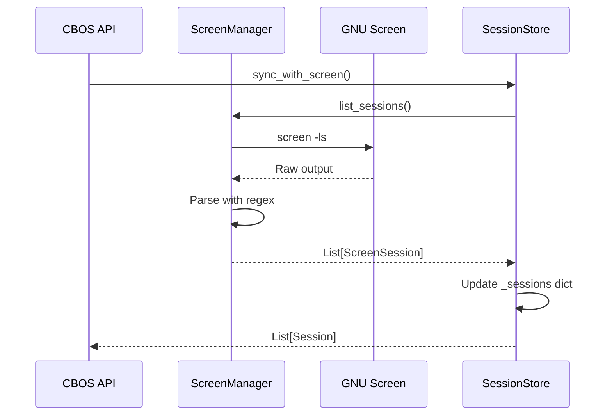
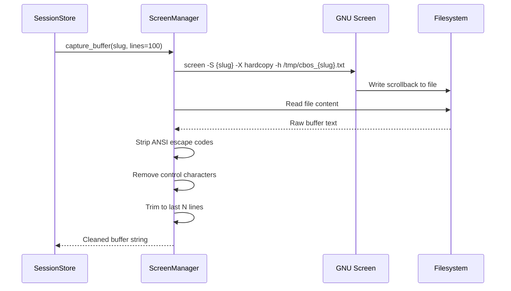
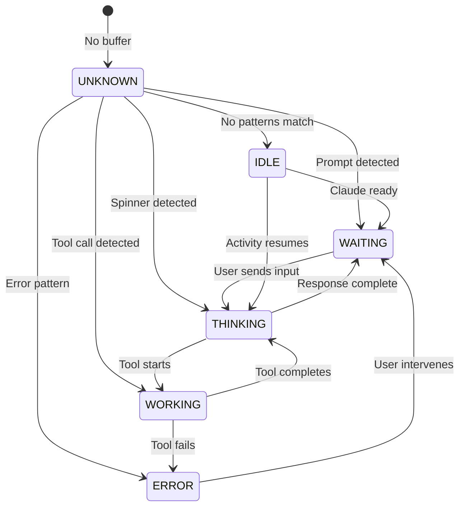
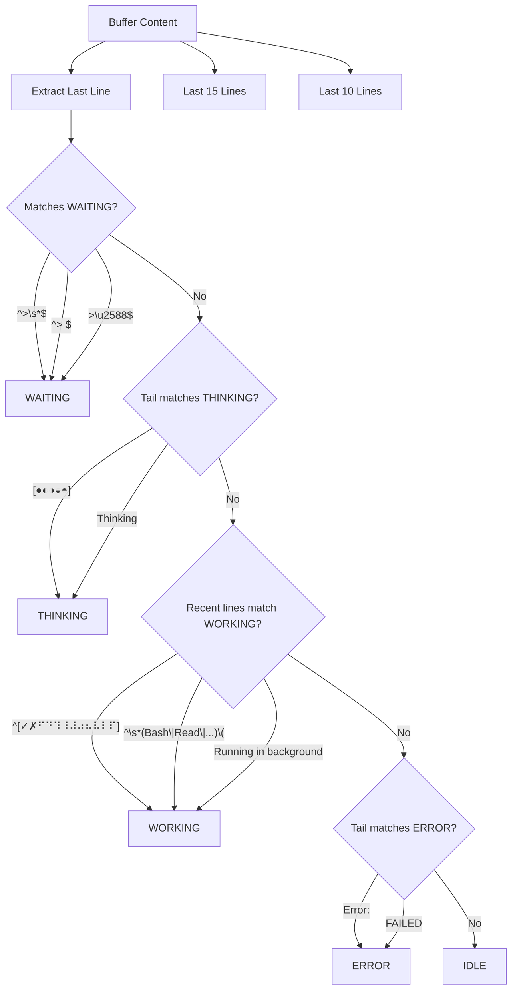
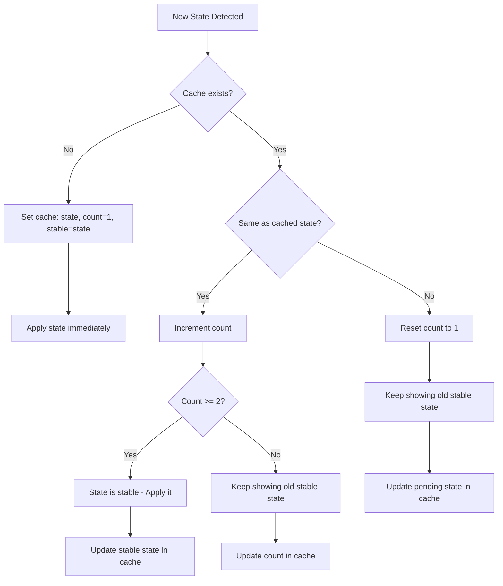
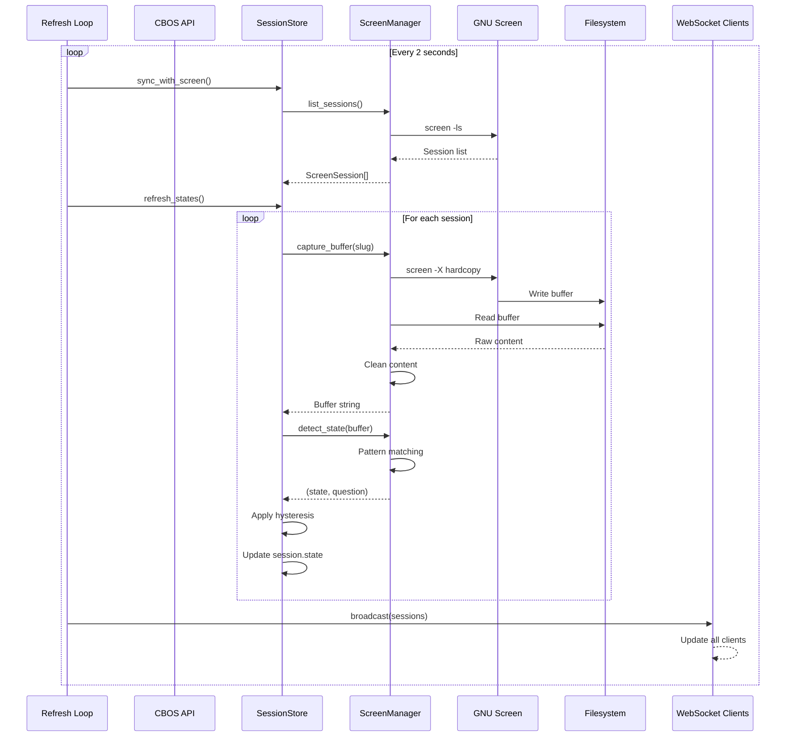
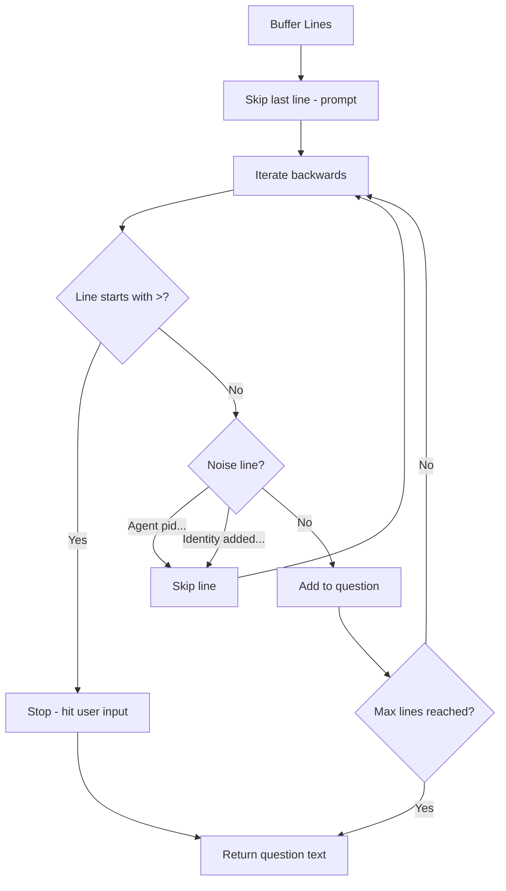

# CBOS Session State Detection Workflow

This document details the logic flow from capturing GNU Screen session data to determining the current Claude Code state.

## Overview

```mermaid
flowchart TB
    subgraph Discovery["1. Session Discovery"]
        A[screen -ls] --> B[Parse Output]
        B --> C[ScreenSession Objects]
    end

    subgraph Capture["2. Buffer Capture"]
        C --> D[screen -X hardcopy]
        D --> E[Read /tmp/cbos_{slug}.txt]
        E --> F[Strip ANSI Codes]
        F --> G[Clean Buffer Text]
    end

    subgraph Detection["3. State Detection"]
        G --> H{Pattern Matching}
        H -->|WAITING patterns| I[WAITING]
        H -->|THINKING patterns| J[THINKING]
        H -->|WORKING patterns| K[WORKING]
        H -->|ERROR patterns| L[ERROR]
        H -->|No match| M[IDLE]
    end

    subgraph Hysteresis["4. State Hysteresis"]
        I & J & K & L & M --> N{Same as cached?}
        N -->|Yes, count >= 2| O[Apply State]
        N -->|Yes, count < 2| P[Increment Count]
        N -->|No| Q[Reset Count, Keep Old]
        O & P & Q --> R[Final Session State]
    end
```

---

## 1. Session Discovery

CBOS discovers active Claude Code sessions by parsing GNU Screen's session list.

### Flow



### Implementation

**File:** `cbos/core/screen.py`

```python
def list_sessions(self) -> list[ScreenSession]:
    result = subprocess.run(["screen", "-ls"], capture_output=True, text=True)

    # Parse: 900379.AUTH (01/01/2026 09:00:39 PM) (Attached)
    pattern = r"(\d+)\.(\S+)\s+\(([^)]+)\)\s+\((Attached|Detached)\)"

    for match in re.finditer(pattern, result.stdout):
        sessions.append(ScreenSession(
            pid=int(match.group(1)),
            name=match.group(2),
            screen_id=f"{pid}.{name}",
            attached=match.group(4) == "Attached"
        ))
```

### Output Structure

| Field | Example | Description |
|-------|---------|-------------|
| `pid` | 900379 | Screen process ID |
| `name` | AUTH | Session slug |
| `screen_id` | 900379.AUTH | Full screen identifier |
| `attached` | true | Whether a terminal is attached |

---

## 2. Buffer Capture

CBOS captures the terminal scrollback buffer using Screen's `hardcopy` command.

### Flow



### Implementation

**File:** `cbos/core/screen.py`

```python
def capture_buffer(self, slug: str, tail_lines: int = 100) -> str:
    tmp = Path(f"/tmp/cbos_{slug}.txt")

    # Capture full scrollback with -h flag
    subprocess.run([
        "screen", "-S", slug, "-X", "hardcopy", "-h", str(tmp)
    ])

    content = tmp.read_text(errors="replace")

    # Strip ANSI escape codes
    content = re.sub(r"\x1b\[[0-9;]*[a-zA-Z]", "", content)

    # Strip control characters (keep newlines)
    content = re.sub(r"[\x00-\x09\x0b-\x1f\x7f]", "", content)

    # Return last N lines
    lines = content.strip().split("\n")
    return "\n".join(lines[-tail_lines:])
```

### Key Details

| Aspect | Value | Notes |
|--------|-------|-------|
| Temp file | `/tmp/cbos_{slug}.txt` | Must be accessible (no PrivateTmp) |
| Default lines | 100 | Configurable per-call |
| ANSI stripping | `\x1b\[[0-9;]*[a-zA-Z]` | Removes color codes |

---

## 3. State Detection

CBOS analyzes the buffer content to determine what Claude Code is currently doing.

### State Machine



### Detection Patterns

**File:** `cbos/core/screen.py`



### Pattern Definitions

| State | Patterns | Check Against |
|-------|----------|---------------|
| **WAITING** | `^>\s*$`, `^> $`, `>█$` | Last line only |
| **THINKING** | `[●◐◑◒◓]`, `Thinking` | Last 15 lines |
| **WORKING** | `^[✓✗⠋⠙⠹...]`, `^\s*(Bash\|Read\|...)` | Last 10 lines (per-line) |
| **ERROR** | `Error:`, `error:`, `FAILED`, `Exception:` | Last 15 lines |
| **IDLE** | (default) | When nothing matches |

### Implementation

```python
def detect_state(self, buffer: str) -> tuple[SessionState, Optional[str]]:
    lines = buffer.strip().split("\n")
    last_line = lines[-1] if lines else ""
    tail = "\n".join(lines[-15:])

    # Priority 1: Check for waiting (prompt visible)
    for pattern in self.WAITING_PATTERNS:
        if re.search(pattern, last_line):
            question = self._extract_last_question(lines)
            return SessionState.WAITING, question

    # Priority 2: Check for thinking (spinners)
    for pattern in self.THINKING_PATTERNS:
        if re.search(pattern, tail):
            return SessionState.THINKING, None

    # Priority 3: Check for working (tool execution)
    for line in lines[-10:]:
        for pattern in self.WORKING_PATTERNS:
            if re.search(pattern, line):
                return SessionState.WORKING, None

    # Priority 4: Check for error
    for pattern in self.ERROR_PATTERNS:
        if re.search(pattern, tail):
            return SessionState.ERROR, None

    # Default: Idle
    return SessionState.IDLE, None
```

---

## 4. State Hysteresis

To prevent state "flapping" (rapid switching between states), CBOS requires a state to be detected consistently before applying it.

### Logic Flow



### Cache Structure

```python
# _state_cache: dict[str, tuple[SessionState, int, SessionState]]
#                           ^current    ^count  ^stable

# Example cache entries:
{
    "AUTH": (WAITING, 3, WAITING),   # Stable at WAITING
    "INTEL": (WORKING, 1, IDLE),     # Detected WORKING once, showing IDLE
    "DOCS": (THINKING, 2, THINKING), # Just became stable at THINKING
}
```

### Implementation

**File:** `cbos/core/store.py`

```python
def refresh_states(self) -> list[Session]:
    for session in self._sessions.values():
        buffer = self.screen.capture_buffer(session.slug)
        new_state, question = self.screen.detect_state(buffer)

        cached = self._state_cache.get(slug)

        if cached is None:
            # First reading - set initial state
            self._state_cache[slug] = (new_state, 1, new_state)
            session.state = new_state
        else:
            current_state, count, stable_state = cached

            if current_state == new_state:
                # Same state detected, increment count
                new_count = count + 1
                if new_count >= 2:
                    # State is now stable, apply it
                    session.state = new_state
                    self._state_cache[slug] = (new_state, new_count, new_state)
                else:
                    # Not yet stable, keep old state
                    self._state_cache[slug] = (new_state, new_count, stable_state)
                    session.state = stable_state
            else:
                # Different state - reset count, keep old stable state
                self._state_cache[slug] = (new_state, 1, stable_state)
                session.state = stable_state
```

### Timing

| Parameter | Value | Effect |
|-----------|-------|--------|
| Refresh interval | 2 seconds | How often states are checked |
| Stability threshold | 2 readings | State must be seen 2x before switching |
| Effective delay | 2-4 seconds | Time to switch to new state |

---

## 5. Complete Data Flow



---

## 6. Question Extraction

When a session is in WAITING state, CBOS extracts the question Claude is asking.

### Logic



### Implementation

```python
def _extract_last_question(self, lines: list[str], max_lines: int = 10) -> Optional[str]:
    question_lines = []

    # Start from second-to-last line (skip the prompt)
    for line in reversed(lines[:-1]):
        stripped = line.strip()

        # Stop if we hit previous user input
        if stripped.startswith(">") and not stripped.startswith("> "):
            break

        # Skip noise lines
        if stripped.startswith("Agent pid") or stripped.startswith("Identity added"):
            continue

        if stripped:
            question_lines.insert(0, stripped)

        if len(question_lines) >= max_lines:
            break

    return "\n".join(question_lines) if question_lines else None
```

---

## 7. Session States Reference

| State | Icon | Meaning | Detected By |
|-------|------|---------|-------------|
| `WAITING` | `○` | Waiting for user input | Prompt `>` on last line |
| `THINKING` | `◐` | Processing/reasoning | Spinner characters |
| `WORKING` | `●` | Executing tools | Tool call patterns |
| `IDLE` | `◌` | Ready but no activity | No patterns match |
| `ERROR` | `✗` | Error occurred | Error text patterns |
| `UNKNOWN` | `?` | Cannot determine | Empty/invalid buffer |

---

## 8. Files Reference

| File | Purpose |
|------|---------|
| `cbos/core/screen.py` | GNU Screen interaction, state detection |
| `cbos/core/store.py` | Session management, hysteresis logic |
| `cbos/core/models.py` | Session and state data models |
| `cbos/api/main.py` | REST/WebSocket endpoints |
| `cbos/tui/app.py` | Terminal UI display |
