# CBOS Orchestrator MVP

> **Vision**: Transform CBOS from a session monitor into an intelligent orchestration system that coordinates multiple ClaudeCode sessions with minimal human intervention.

## Executive Summary

This document outlines the MVP for a **hierarchical multi-agent system** where:

- **Oracle (You)**: Sets strategic direction via “marching orders” - contacted only for unanswerable questions or phase completions
- **Coordinator**: AI layer that auto-answers routine questions, builds consensus across sessions, and escalates intelligently
- **ClaudeCode Sessions**: Workers executing on different components of a larger system

The goal is to automate 60-70% of the `AskUserQuestion` interrupts, transforming interrupt-driven management into strategic oversight.

-----

## System Architecture

```mermaid
flowchart TB
    subgraph Oracle["🧑‍💼 ORACLE (Human)"]
        MO[Marching Orders]
        ED[Escalation Decisions]
    end

    subgraph Coordinator["🤖 COORDINATOR SERVICE"]
        AR[Auto-Responder]
        CE[Consensus Engine]
        CS[Context Store]
        CD[Conflict Detector]
        PS[Pattern Store]
    end

    subgraph Sessions["⚡ CLAUDECODE SESSIONS"]
        S1[Session A<br/>Frontend]
        S2[Session B<br/>Backend]
        S3[Session C<br/>Infrastructure]
    end

    MO -->|Goals & Constraints| CS
    CS -->|Shared Context| AR
    PS -->|Historical Patterns| AR
    
    S1 <-->|Questions/Answers| AR
    S2 <-->|Questions/Answers| AR
    S3 <-->|Questions/Answers| AR
    
    S1 & S2 & S3 -->|File Changes| CD
    CD -->|Conflicts| CE
    
    AR -->|Low Confidence| CE
    CE -->|Unresolvable| ED
    ED -->|Decisions| CS
    
    style Oracle fill:#e1f5fe
    style Coordinator fill:#fff3e0
    style Sessions fill:#e8f5e9
```



-----

## Question Analysis

Analysis of ClaudeCode’s `AskUserQuestion` patterns reveals significant automation potential:


|Question Type     |Frequency|Automatable|Strategy                    |
|------------------|---------|-----------|----------------------------|
|**Permission**    |~40%     |✅ Yes      |Rule-based policies         |
|**Clarification** |~25%     |✅ Yes      |Context inference + patterns|
|**Decision**      |~20%     |⚠️ Sometimes|Consensus engine            |
|**Blocking**      |~10%     |❌ No       |Escalate to Oracle          |
|**Error Recovery**|~5%      |⚠️ Sometimes|Retry logic + patterns      |

**Key Insight**: 60-70% of questions can be auto-answered, transforming the Oracle’s role from interrupt handler to strategic director.

-----

## Data Flow


-----

## Component Design

### 1. Pattern Store

Learns from your month of ClaudeCode conversation history to build a queryable database of decision patterns.

```mermaid
flowchart LR
    subgraph Input["📥 Input"]
        CL[~/.claude/projects/*.jsonl]
    end

    subgraph Processing["⚙️ Processing"]
        EX[Pattern Extractor]
        EM[Embedding Generator]
    end

    subgraph Storage["💾 Storage"]
        VDB[(Vector DB)]
        RDB[(Rules DB)]
    end

    subgraph Query["🔍 Query"]
        QE[Query Engine]
        SM[Similarity Matcher]
    end

    CL --> EX
    EX --> EM
    EM --> VDB
    EX -->|Explicit Rules| RDB
    
    QE --> SM
    SM --> VDB
    SM --> RDB
```



**Pattern Schema**:

```python
class DecisionPattern:
    question: str           # The AskUserQuestion content
    context: str            # Surrounding conversation context
    user_answer: str        # How the user responded
    thinking: str | None    # Claude's reasoning (if available)
    project: str            # Source project
    embedding: list[float]  # Vector representation
    confidence: float       # Match confidence when queried
```

### 2. Auto-Responder

First line of defense - handles routine questions without escalation.


**Rules Engine** (YAML configuration):

```yaml
rules:
  # Always approve
  - pattern: "Should I (proceed|continue|run this)"
    context_requires: ["no destructive operations"]
    answer: "yes"
    confidence: 1.0
    
  - pattern: "Install .* dependencies"
    answer: "yes"
    confidence: 1.0
    
  - pattern: "Create .* (directory|folder|file)"
    answer: "yes"
    confidence: 1.0

  # Always escalate
  - pattern: "(Delete|Remove|Drop) .*"
    escalate: true
    reason: "Destructive operation"
    
  - pattern: ".*(production|prod|live).*"
    escalate: true
    reason: "Production environment"
```

### 3. Consensus Engine

Resolves decisions that affect multiple sessions or have low auto-responder confidence.


### 4. Conflict Detector

Prevents sessions from stepping on each other.


-----

## Oracle Interface

The Oracle Dashboard minimizes interruptions while maintaining strategic control.

```mermaid
flowchart TB
    subgraph Dashboard["📊 ORACLE DASHBOARD"]
        subgraph Urgent["🔴 NEEDS DECISION"]
            D1[Database Schema Change<br/>Sessions: BACKEND, DATA<br/>AI Rec: Option A 85%]
            D2[External API Choice<br/>Session: INTEGRATIONS<br/>Options: Stripe / Square]
        end
        
        subgraph Auto["✅ AUTO-RESOLVED TODAY"]
            A1[23 Permission Requests]
            A2[15 Clarifications]
            A3[9 Consensus Decisions]
        end
        
        subgraph Orders["📋 MARCHING ORDERS"]
            M1[Mission: Auth System MVP]
            M2[Priorities: Login → JWT → Reset]
            M3[Constraints: No OAuth yet]
        end
    end
    
    style Urgent fill:#ffcdd2
    style Auto fill:#c8e6c9
    style Orders fill:#e1f5fe
```



**Marching Orders Schema**:

```yaml
mission:
  name: "Authentication System MVP"
  deadline: "2025-01-15"
  
goals:
  - id: auth-login
    description: "Implement login flow with email/password"
    assigned_sessions: [BACKEND, FRONTEND]
    priority: 1
    status: in_progress
    
  - id: auth-jwt
    description: "JWT token generation and validation"
    assigned_sessions: [BACKEND]
    priority: 2
    depends_on: [auth-login]
    status: pending

constraints:
  - "No external auth providers (OAuth) in MVP"
  - "Use bcrypt for password hashing"
  - "Tokens expire after 24 hours"

escalation_triggers:
  - "Any database schema changes"
  - "New external dependencies"
  - "Security-related decisions"
```

-----

## Implementation Phases


### Week 1: Foundation

|Task              |Description                                                               |Deliverable                        |
|------------------|--------------------------------------------------------------------------|-----------------------------------|
|Pattern Extraction|Extend `extract_conversations.py` to find AskUserQuestion → response pairs|`extract_decisions.py`             |
|Pattern Database  |SQLite + vector embeddings storage                                        |`~/.cbos/patterns.db`              |
|Pattern Store     |Queryable pattern store with similarity search                            |`cbos/coordinator/pattern_store.py`|
|CLI Tool          |Query patterns from command line                                          |`cbos-patterns query "..."`        |

### Week 2: Auto-Responder

|Task               |Description                        |Deliverable                    |
|-------------------|-----------------------------------|-------------------------------|
|Rules Engine       |YAML-based rule matching           |`~/.cbos/rules.yaml`           |
|Pattern Integration|Connect pattern store to CBOS API  |`/sessions/{slug}/auto-respond`|
|Response Generation|LLM fallback for unknown patterns  |`cbos/coordinator/responder.py`|
|TUI Integration    |Visual indicator for auto-responses|🤖 icon in session list         |

### Week 3: Coordinator

|Task              |Description                      |Deliverable                    |
|------------------|---------------------------------|-------------------------------|
|Context Store     |Shared state across sessions     |Redis/in-memory store          |
|Session Monitor   |Track what each session is doing |`cbos/coordinator/monitor.py`  |
|Consensus Engine  |Multi-session decision resolution|`cbos/coordinator/consensus.py`|
|Conflict Detection|File lock tracking               |`cbos/coordinator/conflicts.py`|

### Week 4: Oracle Interface

|Task            |Description                       |Deliverable                     |
|----------------|----------------------------------|--------------------------------|
|Marching Orders |Parse and distribute goals        |`~/.cbos/mission.yaml`          |
|Escalation Queue|Prioritized pending decisions     |`/coordinator/decisions/pending`|
|Oracle Dashboard|TUI for strategic decisions       |New TUI view                    |
|Learning Loop   |Store Oracle decisions as patterns|Feedback integration            |

-----

## API Specification

### New Endpoints


|Endpoint                             |Method|Description                                   |
|-------------------------------------|------|----------------------------------------------|
|`/coordinator/mission`               |POST  |Set marching orders for all sessions          |
|`/coordinator/status`                |GET   |Overview of all sessions + pending decisions  |
|`/coordinator/decisions/pending`     |GET   |Decisions awaiting Oracle input               |
|`/coordinator/decisions/{id}/resolve`|POST  |Oracle resolves a decision                    |
|`/sessions/{slug}/auto-respond`      |GET   |Get auto-response suggestion (preview)        |
|`/sessions/{slug}/auto-respond`      |POST  |Execute auto-respond if confidence > threshold|
|`/sessions/{slug}/context`           |GET   |Get session’s current context                 |
|`/patterns/query`                    |GET   |Query pattern store                           |
|`/patterns/store`                    |POST  |Store new pattern                             |

-----

## Data Models


-----

## Training Data Pipeline

Leverage your month of ClaudeCode logs to bootstrap the pattern store.

```mermaid
flowchart TD
    subgraph Source["📁 Source Data"]
        CL[~/.claude/projects/*.jsonl]
        HI[~/.claude/history.jsonl]
    end

    subgraph Extract["🔍 Extraction"]
        PE[Pattern Extractor]
        FQ[Find AskUserQuestion]
        FR[Find User Response]
        FC[Extract Context]
    end

    subgraph Process["⚙️ Processing"]
        CL[Clean & Normalize]
        EM[Generate Embeddings]
        CL2[Classify Question Type]
        DE[Deduplicate]
    end

    subgraph Store["💾 Storage"]
        VDB[(Vector Store)]
        RDB[(Relational DB)]
        IDX[Build Indices]
    end

    Source --> Extract
    Extract --> Process
    Process --> Store

    subgraph Stats["📊 Statistics"]
        ST[Pattern Stats]
        CV[Coverage Analysis]
        QT[Question Types]
    end

    Store --> Stats
```



**Extraction Command**:

```bash
# Extract decision patterns from all projects
python scripts/extract_decisions.py \
  --include-thinking \
  --output ~/.cbos/patterns/raw.jsonl

# Build pattern database
cbos-patterns build ~/.cbos/patterns/raw.jsonl

# View statistics
cbos-patterns stats
```

-----

## Success Metrics


|Metric                   |Target     |Measurement                              |
|-------------------------|-----------|-----------------------------------------|
|**Auto-response rate**   |>60%       |Decisions auto-resolved / total decisions|
|**Oracle interrupts/day**|<5         |Escalations requiring human input        |
|**False positive rate**  |<10%       |Auto-responses user would have rejected  |
|**Response latency**     |<2s        |Time from question to auto-response      |
|**Session throughput**   |2x baseline|Tasks completed per session per day      |

-----

## Configuration

### Environment Variables

```bash
# ~/.cbos/.env

# Coordinator settings
CBOS_COORDINATOR_ENABLED=true
CBOS_AUTO_RESPOND_THRESHOLD=0.85
CBOS_AUTO_RESPOND_MODE=notify  # silent | notify | confirm

# Pattern store
CBOS_PATTERN_DB=~/.cbos/patterns.db
CBOS_EMBEDDING_MODEL=nomic-embed-text

# AI backends
CBOS_RESPONDER_MODEL=mistral-small3.2:latest
CBOS_RESPONDER_PROVIDER=ollama
CBOS_COMPLEX_MODEL=claude-sonnet-4-5-20250929

# Escalation
CBOS_ESCALATION_NOTIFY=true
CBOS_ESCALATION_TIMEOUT=300  # seconds before auto-escalate
```

-----

## Open Questions for Oracle

Before implementation, decisions needed on:

### 1. Confidence Threshold

```
Conservative (0.85): Fewer auto-responses, more escalations
     vs
Aggressive (0.75): More auto-responses, risk of errors
```

**Recommendation**: Start at 0.85, tune down based on false positive rate.

### 2. Auto-Response Behavior

```
Silent:  Send immediately, no notification
Notify:  Send + show what was sent in TUI
Confirm: Show proposed response, send on 5s timeout
```

**Recommendation**: Start with `notify` for visibility.

### 3. Escalation Priority

```
Time-based:       Oldest questions first
Complexity-based: Simplest questions first (clear backlog)
Impact-based:     Blocking questions first
```

**Recommendation**: Impact-based (unblock sessions fastest).

### 4. File Conflict Handling

```
Hard lock: Block second session until first releases
Soft lock: Warn but allow (risk conflicts)
Queue:     Queue changes, apply in order
```

**Recommendation**: Soft lock with warnings for MVP.

-----

## Future Enhancements (Post-MVP)


-----

## Appendix: File Structure

```
cbos/
├── coordinator/
│   ├── __init__.py
│   ├── auto_responder.py    # Question answering logic
│   ├── consensus.py         # Multi-session decisions
│   ├── conflicts.py         # File conflict detection
│   ├── context_store.py     # Shared session context
│   ├── models.py            # Data models
│   ├── monitor.py           # Session monitoring
│   ├── pattern_store.py     # Pattern database
│   └── rules.py             # Rules engine
├── api/
│   ├── main.py              # Extended with coordinator routes
│   └── coordinator_routes.py
├── tui/
│   ├── app.py               # Extended with Oracle dashboard
│   └── oracle_view.py
└── scripts/
    ├── extract_decisions.py # Pattern extraction
    └── build_patterns.py    # Pattern DB builder
```

-----

## Next Steps

1. **Review this document** - Confirm direction and answer open questions
1. **Extract patterns** - Run pattern extraction on your ClaudeCode logs
1. **Build pattern store** - Create the foundation database
1. **Implement auto-responder** - Start answering routine questions
1. **Iterate** - Add consensus engine and Oracle interface based on learnings

-----

*Document Version: 1.0*  
*Last Updated: January 2025*  
*Status: Awaiting Oracle Approval* 🎯
